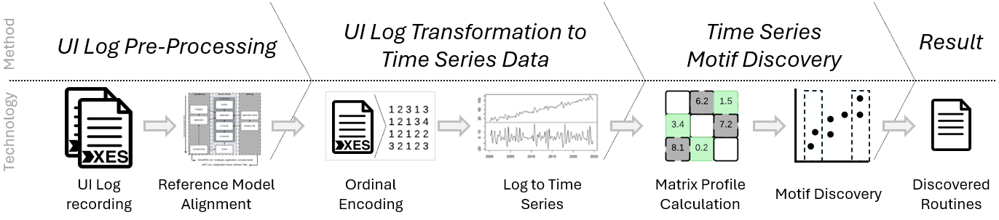
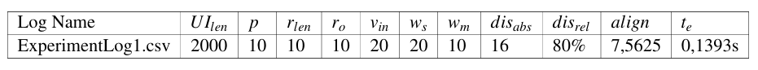

# TSMDforUILogs
Time Series Motif Discovery for User Interaction Logs

Where is the routine? A question asked once a business is looking for automation possibilites.
With this approach the question is no longer a manual search mission.
With the TSMD approach large sets of user interaction data, i.e., merged logs, are scanned easy and fast.
This read-me file describes the three Jupyter notebooks that are relevant for the paper "Where is the Motif"?

## The Approach



The approach has eight sequential steps, of which the first two steps are manual pre-processing steps and the following four steps are automatically executed:

1. The recording of the user interactions into one or multiple logs, which has to be done before (semi-)automatically using tools such as [SmartRPA](https://github.com/bpm-diag/smartRPA) by Agostinelli et al. or [Tockler](http://www.irisbeerepoot.com/wp-content/uploads/2023/06/Practical-guidelines.pdf) as described by Beerepoot et al.
2. Once the recording data is available it has to be
    1. normalized, i.e., all action attributes inherit the same alphabet if recorded by different applications,
    2. aligned to the [reference model of Abb and Rehse](https://www.sciencedirect.com/science/article/pii/S0306437924000449) by generating a hierarchical attribute structure,
    3. merged into a single log file to be processed by the approach
3. The normalized, aligned, and merged UI log is then discretizised leading to a numerical representation of the each action
4. This numerical representation is then ordered sequentially by log and timestamp information to be a time series
5. Once the log is a time series the matrix profil is calculated using the [Stumpy Python library](https://stumpy.readthedocs.io/en/latest/Tutorial_The_Matrix_Profile.html).
6. Based on the matrix profil the most similar motifs, i.e., the original routines, are discovered
7. The discovered routines are then gathered from the un-encoded UI log based on the indexes generted in step 6.
8. Finally, [pm4py](https://pm4py.fit.fraunhofer.de/) is used to discover a directly follows graph for visualizing the discovered routine and the time series graphs are displayed as well

## Single Log Discovery Notebook
The single log discovery notebook is setup to process a single User Interaction log that can contain a routine.
The **first section** imports all necessary functions, including the util.util and other native Python libraries.
The **second section** configured the parameters, which have to be set to make the approach work.
Please specifiy your file, the columns you aligned to the reference model, and the window size parameter particulary.
The **third section** does execute the encoding, discovery, and visualisation. Do not change anything in there to have the approach working.

## Validation Log Creation Notebook
As described in the evaluation section of the paper, the experiment relies on a set of arteficially created user interaction logs.
You can create your own set and follow the process of the log creation by utilizing the "validationLogCreation" notebook.

<details>

<summary>Setting up the parameters as in the paper</summary>

To create validation data as in the publication use the following parameter setup

```randomness = [1] # Length of sampling sequence, when creating the baseline log (1=> only one event inserted, 2=> sequences of 2 from all possible events inserted ...)
motifs = [1] # how many different motifs should be inserted into the log
occurances = [10,15,20,30,60] # Number of motif appearances in the log
lengthMotifs = [5,10,15,20,25] # Length of the Motifs to be inserted
percentageMotifsOverLog = [10,5,2.5,1] # Percentage representation of the Motif in the log
shuffles = [0,10,20] # Percentage by which the inserted routine should be shuffled
```

</details>

## Experiment Notebook
To execute the experiment and gather the insights as presented in the paper, just two steps are necessary:

1. Put the correct path in the parameters
2. Specify the list of window sizes that should be tested

Afterwards, the experiment can be executed and will create a .csv file containing the parameters as defined in the publication.
Once the file is converted into an XLSX file and the data is seperated into columns, the pivot function allows for creation of the graphs visualized in the paper.

## Experiment Results

The experiment results from the paper are available in the file **Results - Experiment.xlsx**. 
In this file you will find two sheets. The first sheet contains the collected experiment results on which the evaluation section is based on. The second sheet contains the figures presented in the evaluation section of the paper. This file contains the all collected values from the experiment as outlined in the paper:



You can reproduce the experiment by executin the **experiment** notebook after you have (a) selected the synthetic validation data or (b) run the **Validation Log Creation** notebook.
The validation data to compare the discovered result by the approach automatically is stored in the file **validationDataPercentage.csv**

## Real World Experiment

The real-world process was designed based on experience in small and medium size enterprises and reflects a common, yet simplified, version of an accounts payable process.
The instruction given to the auther is stored in the **logs/Banking/** folder: [Real World Accounts Payable Instruction](logs/Banking/RealWorldProcessInstruction.pdf)
The generated UI logs (SmartRPA/Tockler) are available in the same folder. 
The logs are anonymized to not reflect any author data.