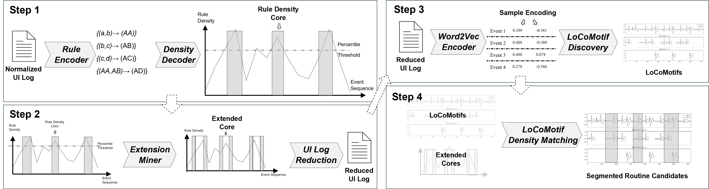

# Time Series Routine Discovery
Time Series Routine Discovery (TSRD) for User Interaction Logs

Where is the routine? What routines do we actually do?
Question asked once a business is looking for automation possibilites.
With this approach the question is no longer a pure manual search mission.
With the TSMD approach large sets of user interaction data, i.e., merged logs, are scanned easy and fast.
This read-me file describes the three Jupyter notebooks that are relevant for the paper "Enabling Routine Discovery from High-Noise UI Logs: A Time Series Data Mining Approach"?

## The Approach

The approach has four sequential steps. You will first get to know them and in the section on the Jupyter Notebooks you will understand, how to use the approach and recreate our experiment:

1. The approach takes as an input a UI log. This log is tokenized by using Re-Pair Grammar Rules. The Grammar Rules are a tool to identify variable length motifs in time series data. Senin et al. have shown this in [GrammarViz 3.0](https://dl.acm.org/doi/abs/10.1145/3051126).
2. Based on the so-called Grammar Cores from 1., we can filter the time series to only contain routine candidate sections from the UI log. The approach identifies app switch and process switch patterns in the UI log and extends the Grammar Cores. Afterwards, the log is reduced to only contain these extended cores.
3. In step 3 the reduced log is encoded using Word2vec as described already by [Hohenadl 2025](https://link.springer.com/chapter/10.1007/978-3-032-02936-2_20). Afterwards, [LoCoMotif](https://github.com/ML-KULeuven/locomotif) is applied to identify variable length time series motifs in the reduced, embedded UI log.
4. The output from step 3 is mapped against the Grammar Cores of step 1 to filter all potential motifs for real automation worthy candidates.

The final result is a set of sets. Each set contains n candidates already clustered by the similarity.
More details on every step are available in the paper.

In the next section you will understand die Notebooks in the [Jupyter Notebooks folder](/JupyterNotebooks/).

# Jupyter Notebooks Prepared

There are 3 notebooks ready to be used.

- 00_TS-G-RD: The notebook does contain the **EX2** from the paper. Just execute the single cell in the notebook and the experiment will start running. Make sure, that the result file has a new name. The result will be stored in the [SmartRPA Folder](/logs/smartRPA/20511-results) if not updated/changed.
- 01x_VALMOD_word2vec: The notebook has the single log execution for **EX1**. In the first cell all necessary data is imported. In the second cell, select the valid Leno et al. logs. The candidate logs are described in the cell.
- 01x_Log_Discovery: The notebook is for you to setup everything and execute your own log for motif discovery. All necessary steps are explained in that notebook.
- 04_GT_Comparison_Log_Creation: For **EX1** we had to generate the proper ground truth from the Leno et al. logs. The notebook lets you recreate the logs for the different approaches of [Leno et al.](10.1109/ICPM49681.2020.00031), [Agostinelli et al.](https://doi.org/10.1007/978-3-030-91431-8_5), and [Rebmann and van der Aa](https://doi.org/10.1007/978-3-031-34560-9_9).
- 04_validationLogCreation: This log is used for **EX2** to create the validation logs. Execute the notebook the recieve a complete set of synthetic logs for testing into the specified folder.
