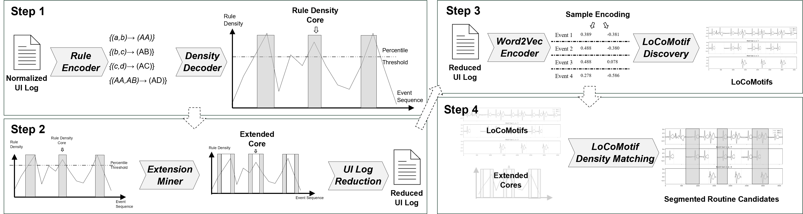

# Time Series Routine Discovery (TS-GRD)

Replication package for the paper:
> **"Enabling Routine Discovery from High-Noise UI Logs: A Time Series Data Mining Approach"**

TS-GRD scans merged UI interaction logs for recurring routines — answering the question *"Where is the routine?"* without manual inspection. The approach combines Re-Pair grammar encoding, app-switch context filtering, and variable-length time series motif discovery (LOCOmotif) to identify automation-worthy candidate routines in large, noisy logs.

---

## Research Questions

The paper is structured around two experimental cases and four sub-questions:

### Experimental Case 1 (EX1) — Effectiveness and Influence Factors
> *Does the approach work, and what drives its performance?*

| Sub-question | Focus | Notebook |
|---|---|---|
| **SQ1** | Does the approach effectively discover routines in high-noise UI logs? | `00_EX1.ipynb` |
| **SQ2** | What influence factors impact the effectiveness of the TS-GRD approach performance? | `00_EX2.ipynb` + `00_EX1.ipynb` §3 |
| **SQ3** | To what extent can internal log metrics serve as unsupervised proxies to estimate routine discovery success in the absence of ground-truth labels? | `00_EX1.ipynb` §3 |

### Experimental Case 2 (EX2) — Comparison with State-of-the-Art
> *How does the approach compare to existing RPM approaches?*

| Sub-question | Focus | Notebook |
|---|---|---|
| **SQ4** | How does TS-GRD perform compared to existing SOTA approaches in no-inter-noise and inter-noise settings? | `02_Ground_Truth.ipynb` (baseline generation) |

---

## The Approach



The pipeline has four sequential steps:

1. **Grammar encoding** — The UI log is tokenised using Re-Pair grammar rules. Events that co-occur frequently form higher-order rules with a high rule-density count. Contiguous segments of peak density become *grammar cores* — candidate routine locations. (See [GrammarViz 3.0](https://dl.acm.org/doi/abs/10.1145/3051126), Senin et al.)

2. **Context-guided log reduction** — App-switch and process-switch patterns are mined from the grammar cores. The log is filtered to retain only the windows around detected cores, extended by app-switch boundaries and a safety margin. This reduces the LOCOmotif search space while preserving all motif-bearing regions.

3. **Variable-length motif discovery** — The filtered log is encoded with Word2Vec (see [Hohenadl 2025](https://link.springer.com/chapter/10.1007/978-3-032-02936-2_20)) and passed to [LOCOmotif](https://github.com/ML-KULeuven/locomotif), which discovers groups of similar subsequences of variable length.

4. **Grammar-motif alignment** — LOCOmotif candidates are mapped back to original log indices and filtered against the grammar cores from Step 1. Only candidates that overlap a grammar core are retained and anchor-extended to produce the final routine set.

The result is a set of clusters, each containing *n* candidate routine occurrences already grouped by similarity.

---

## Repository Structure

```
TSMDforUILogs/
├── JupyterNotebooks/
│   ├── 00_EX1.ipynb          # EX1: single-log evaluation (SQ1 + SQ3)
│   ├── 00_EX2.ipynb          # EX1 batch experiment for SQ2 influence factors
│   ├── 01_Discovery.ipynb    # Template: run the approach on your own log
│   ├── 02_Ground_Truth.ipynb # Generate Leno ground truth + SOTA baseline logs
│   ├── 02_Synthetic_Logs.ipynb # Generate synthetic validation log suite
│   ├── evaluation.ipynb      # Additional evaluation utilities
│   └── experiment.py         # Batch experiment wrapper (called by 00_EX2.ipynb)
├── util/                     # Core algorithm modules
├── logs/
│   ├── Leno/                 # Leno et al. benchmark logs and ground truths
│   └── smartRPA/
│       ├── 202511-update/    # Synthetic validation log metadata
│       └── 202511-results/   # Experiment output CSVs (written at runtime)
├── archive/                  # Earlier experimental notebooks (not part of pipeline)
└── requirements.txt
```

---

## Setup

Requires **Python 3.12**. A Conda or `.venv` environment is recommended.

```bash
pip install -r requirements.txt
```

All notebooks are in `JupyterNotebooks/`. They use relative paths (`../logs/`) so run them from that directory or open them with Jupyter/VS Code with the workspace root set correctly.

---

## Notebooks

### `00_EX1.ipynb` — EX1: Single-Log Evaluation (SQ1, SQ3)

Runs the full four-step pipeline on one of four Leno benchmark logs and evaluates the result against ground truth. Also contains **Section 3** (variance correlation analysis) which answers SQ3 using the batch results produced by `00_EX2.ipynb`.

**Step 1 — Select a case** (set `CASE` in the *Case Selection* cell):

| `CASE` value | Arrangement | Noise | Answers |
|---|---|---|---|
| `"SR_RT_Plus"` | Sequential — all Student Record traces before Reimbursement | None | SQ1 baseline |
| `"SR_RT_parallel"` | Parallel — Student Record and Reimbursement interleaved | None | SQ1 baseline |
| `"SR_RT_plus_extended"` | Sequential | Intra-motif (50 random events per case) | SQ1 noise robustness |
| `"SR_RT_parallel_extended"` | Parallel | Intra-motif (50 random events per case) | SQ1 noise robustness |

**Step 2 — Run all cells** (**Run All**).

**Step 3 — Section 3 (SQ3):** requires `00_EX2.ipynb` to have been run first to produce the variance and validation result CSVs.

**Outputs:** Precision / Recall / F1 per evaluation view, overlap distribution, grammar variance scatter, execution time breakdown, correlation table (Section 3).

---

### `00_EX2.ipynb` — EX1 Batch Experiment: Influence Factors (SQ2, SQ3 data)

Runs the pipeline over the full synthetic log suite across four `rho` values (`0.6`, `0.7`, `0.8`, `0.9`) to identify which log properties drive discovery performance. Also runs the variance experiment to collect the data analysed in `00_EX1.ipynb` Section 3.

**Run four times — once per `rho` value** (set `rho` in the first code cell, then **Run All**):

| `rho` | Meaning | Result file suffix |
|---|---|---|
| `0.6` | Loose similarity — more, broader motifs | `rho06` |
| `0.7` | Moderate similarity | `rho07` |
| `0.8` | Paper default | `rho08` |
| `0.9` | Strict similarity — fewer, tighter motifs | `rho09` |

Results are written **incrementally** after each log — the run is **resumable** if interrupted.

**Runtime by log size:**

| Log size | Section 1 (full pipeline) | Section 2 (variance only) |
|---|---|---|
| ≤ 5 000 events | Seconds | Seconds |
| ~10 000 events | 1–4 min | < 1 min |
| ~150 000 events | Hours | Minutes |
| ~250 000 events | ~10 hours | ~1 hour |

`log_limit=20000` in Section 1 skips logs above 20 000 events by default.

**Outputs:** Per-log CSV with precision/recall/F1, timing, filtered log length, overlap ratios, and (Section 2) grammar variance data.

---

### `02_Ground_Truth.ipynb` — Ground Truth and SOTA Baseline Generation

Generates the Leno benchmark logs with case IDs, ground truth files, and the baseline comparison data for SQ4. Recreates logs for the approaches of [Leno et al.](https://doi.org/10.1109/ICPM49681.2020.00031), [Agostinelli et al.](https://doi.org/10.1007/978-3-030-91431-8_5), and [Rebmann and van der Aa](https://doi.org/10.1007/978-3-031-34560-9_9).

Run once to populate `logs/Leno/` before executing `00_EX1.ipynb`.

---

### `02_Synthetic_Logs.ipynb` — Synthetic Log Generation

Creates the full synthetic validation log suite used by `00_EX2.ipynb`. Run once to populate `logs/smartRPA/202511-update/` before executing `00_EX2.ipynb`.

---

### `01_Discovery.ipynb` — Custom Log Discovery

Template notebook for applying TS-GRD to your own UI log. All steps are explained inline.

---

## Recommended Execution Order

```
02_Ground_Truth.ipynb       ← generates Leno logs + ground truths
02_Synthetic_Logs.ipynb     ← generates synthetic validation suite
         ↓
00_EX1.ipynb  (Sections 1–2)   ← SQ1: effectiveness on Leno benchmark
00_EX2.ipynb                   ← SQ2: influence factors (run for rho 0.6–0.9)
         ↓
00_EX1.ipynb  (Section 3)      ← SQ3: variance as unsupervised proxy
```

---

## Citation

If you use this replication package, please cite:

> [Full citation to be added upon publication]
